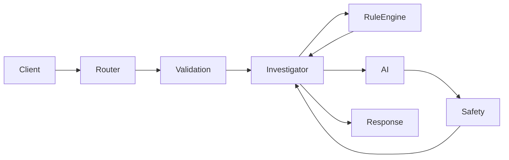
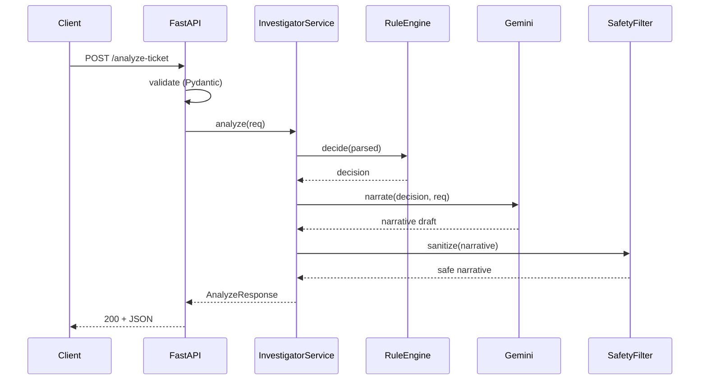
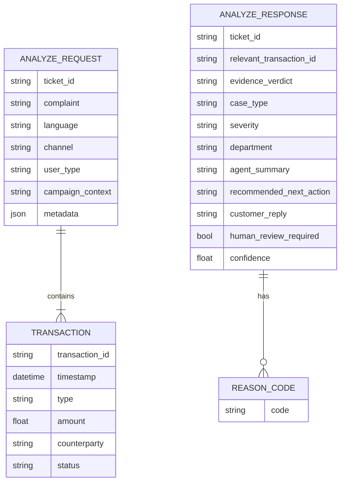

## Plan: QueueStorm Backend Learning Roadmap

**TL;DR**
Twelve small, ordered steps. Each step generates only the files it needs, follows the spec exactly (field names, enums, HTTP codes), explains *why* before *what*, and pauses for your approval. The structure mirrors your suggested layout (`app/api/`, `app/schemas/`, `app/services/`, `app/core/`, `app/utils/`) plus a single `app/main.py` entrypoint.

---

### Step 1 — Project skeleton & dependency manifest
- Create empty package directories (`app/`, `app/api/`, `app/core/`, `app/models/`, `app/schemas/`, `app/services/`, `app/utils/`, `app/prompts/`, `tests/`)
- `requirements.txt` (pinned minor versions), `.env.example`, `.gitignore`, empty `app/__init__.py` files
- **Why:** a clean skeleton prevents circular imports and lets every later step drop a file into a known place
- **Files:** `requirements.txt`, `.env.example`, `.gitignore`, package `__init__.py` files

### Step 2 — Centralized configuration (`app/core/config.py`)
- `pydantic-settings` `Settings` class reading from `.env` (`GEMINI_API_KEY`, `GEMINI_MODEL=gemini-2.5-flash`, `LLM_ENABLED`, `LOG_LEVEL`, `HIGH_VALUE_THRESHOLD`, `LLM_TIMEOUT_SECONDS`)
- Singleton via `lru_cache` — FastAPI will inject this later
- **Why:** no hardcoded secrets, single source of truth, easy to mock in tests
- **Files:** `app/core/config.py`

### Step 3 — Pydantic v2 request schema (`app/schemas/request.py`)
- `AnalyzeRequest` with **exact** fields: `ticket_id`, `complaint`, `language`, `channel`, `user_type`, `campaign_context`, `transaction_history: list[TransactionIn]`, `metadata: dict[str, Any]`
- `TransactionIn` with **exact** fields: `transaction_id`, `timestamp`, `type`, `amount`, `counterparty`, `status`
- Field validators: empty `complaint` → 422; `transaction_history` may be empty (insufficient data is a valid state)
- **Why:** the response schema is meaningless without an unbreakable input contract
- **Files:** `app/schemas/__init__.py`, `app/schemas/request.py`

### Step 4 — Pydantic v2 response schema & enums (`app/schemas/response.py`)
- Enums (exact values only): `EvidenceVerdict`, `Severity`, `CaseType`, `Department`
- `AnalyzeResponse` with the **exact 12 fields** in the **exact order** the spec lists them; `reason_codes: list[str]`
- Strict mode + `model_config = ConfigDict(extra="forbid")` so any drift in field names fails loudly
- **Why:** the response contract is the public promise — never invent, rename, or reorder
- **Files:** `app/schemas/response.py`

### Step 5 — Domain models for internal use (`app/models/`)
- Lightweight dataclasses/Pydantic models internal to the service (e.g. `ParsedComplaint`, `InvestigationDecision`) so the rule engine and AI module never see raw `AnalyzeRequest`
- **Why:** keeps the API boundary thin and the rule/AI engines testable in isolation
- **Files:** `app/models/__init__.py`, `app/models/decision.py`

### Step 6 — FastAPI entrypoint & lifespan (`app/main.py`)
- `FastAPI()` instance, CORS, structured JSON logging via `app/core/logging.py`, lifespan that validates config and (optionally) pings the Gemini client
- No routes yet — just the app object
- **Why:** app object + lifespan must exist before routers can be mounted
- **Files:** `app/main.py`, `app/core/logging.py`

### Step 7 — `GET /health` route (`app/api/health.py`, `app/api/router.py`)
- Returns `{"status":"ok"}` with HTTP 200, **no extra fields**
- Mount under `/health`
- **Why:** smallest possible end-to-end smoke test before adding the complex endpoint
- **Files:** `app/api/__init__.py`, `app/api/router.py`, `app/api/health.py`

### Step 8 — Centralized exception handlers (`app/core/errors.py`)
- Handlers for: `RequestValidationError` → 422 with safe message; malformed JSON → 400; `HTTPException` passthrough; `Exception` → 500 with generic message (no stack traces, no secrets)
- All responses use a uniform `ErrorResponse` shape
- **Why:** spec requires never leaking stack traces/secrets; centralized handlers keep routes clean
- **Files:** `app/core/errors.py`, `app/schemas/error.py`

### Step 9 — Rule-engine interface (`app/services/rule_engine.py`)
- `RuleEngine` Protocol with one method `decide(parsed) -> InvestigationDecision` returning `relevant_transaction_id`, `evidence_verdict`, `case_type`, `severity`, `department`, `human_review_required`, `reason_codes`
- A stub `StubRuleEngine` for now so the API runs before the teammate implements logic
- **Why:** backend must not contain business reasoning — we define the contract, the rule-engine teammate fills it in
- **Files:** `app/services/__init__.py`, `app/services/rule_engine.py`

### Step 10 — AI/Gemini interface (`app/services/ai_service.py` + `app/prompts/`)
- `AIService` Protocol: `narrate(decision, request) -> Narrative` with only `agent_summary`, `recommended_next_action`, `customer_reply`
- `GeminiAIService` using `google-genai` async client, JSON-mode generation, `LLM_TIMEOUT_SECONDS` cap, safe fallback when `LLM_ENABLED=false` or call fails
- Prompt enforces: no OTP/PIN/password/card requests, no refund/reversal/unblock promises, no third-party links
- **Why:** AI is only the narrative layer; the interface guarantees the rule engine owns decisions
- **Files:** `app/services/ai_service.py`, `app/services/gemini_service.py`, `app/prompts/system.txt`, `app/prompts/user.txt`

### Step 11 — Orchestrator + `POST /analyze-ticket` route (`app/services/investigator.py`, `app/api/analyze.py`)
- `InvestigatorService.analyze(req) -> AnalyzeResponse` chains: parse → rule engine → AI → safety filter → assemble
- Mount `POST /analyze-ticket` returning 200 with the full schema; 400/422/500 handled globally
- **`Settings` injected via FastAPI `Depends`** — first introduction of DI
- **Why:** routes stay thin; orchestration is independently testable
- **Files:** `app/services/investigator.py`, `app/api/analyze.py`, updates to `app/api/router.py`, `app/main.py`

### Step 12 — Tests, Dockerfile, README
- `pytest` tests for health, validation (422 on empty complaint), enum allow-lists, schema drift detection, error handlers, and the orchestrator using the stub rule engine + `LLM_ENABLED=false`
- `Dockerfile` (`python:3.12-slim`, non-root, `uvicorn app.main:app --host 0.0.0.0 --port 8000`)
- `.dockerignore`, `docker-compose.yml`, `samples/wrong_transfer.json`
- `README.md` with quickstart, env vars, sample `curl` for `/analyze-ticket`
- **Files:** `tests/test_health.py`, `tests/test_schemas.py`, `tests/test_validation.py`, `tests/test_errors.py`, `tests/test_investigator.py`, `Dockerfile`, `.dockerignore`, `docker-compose.yml`, `samples/wrong_transfer.json`, `README.md`

---

**Relevant files (final layout)**
- `app/main.py` — FastAPI app, lifespan, exception handlers
- `app/api/router.py`, `app/api/health.py`, `app/api/analyze.py` — routes
- `app/schemas/request.py`, `app/schemas/response.py`, `app/schemas/error.py` — Pydantic v2 contracts
- `app/models/decision.py` — internal decision model
- `app/services/rule_engine.py`, `app/services/ai_service.py`, `app/services/gemini_service.py`, `app/services/investigator.py` — interfaces + orchestrator
- `app/core/config.py`, `app/core/logging.py`, `app/core/errors.py` — cross-cutting
- `app/utils/safety.py` — post-processing guard on AI output
- `app/prompts/system.txt`, `app/prompts/user.txt` — prompt templates
- `tests/` — pytest suite
- `Dockerfile`, `docker-compose.yml`, `requirements.txt`, `.env.example`, `.gitignore`, `README.md`, `samples/`

**Diagrams**

**Verification per step**
1. `python -c "import app.main"` — module imports cleanly after each step
2. `curl /health` returns `{"status":"ok"}` once Step 7 lands
3. `pytest -q` passes after Step 12; coverage on schemas, error handlers, and orchestrator
4. `docker build -t queuestorm .` and `docker run --env-file .env -p 8000:8000 queuestorm` serve both endpoints
5. `curl -X POST /analyze-ticket -d @samples/wrong_transfer.json` returns the spec-shaped JSON (Step 11 onward)
