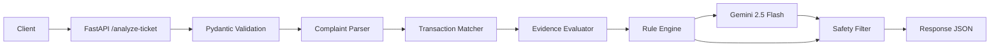
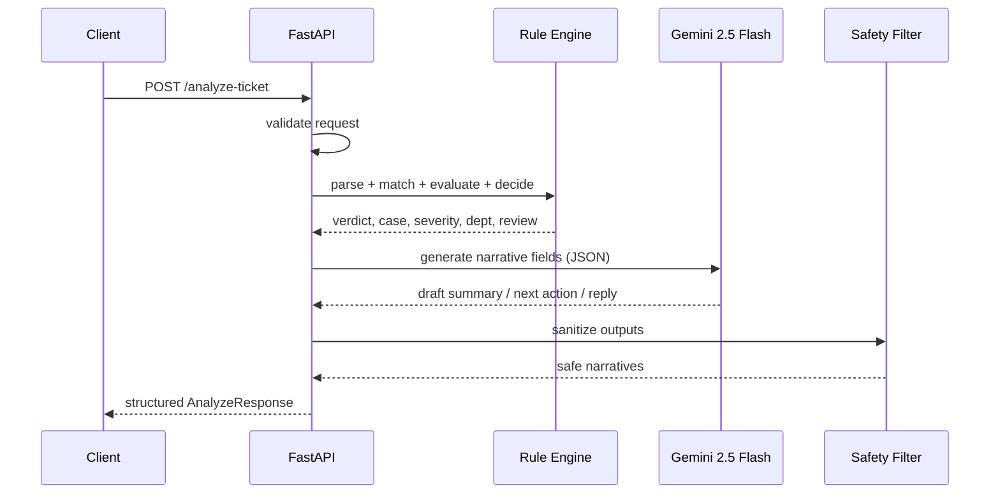

## Plan: QueueStorm Investigator Backend

**TL;DR**
Build a FastAPI service exposing `/health` and `/analyze-ticket`. The pipeline is fully deterministic up to the point of generating three narrative fields: a `complaint_parser` extracts amount/counterparty/keywords, a `transaction_matcher` scores each transaction, an `evidence_evaluator` compares the claim against `transaction.status` to produce `evidence_verdict`, and a `rule_engine` decides `case_type`, `severity`, `department`, and `human_review_required`. Only then does Gemini 2.5 Flash generate `agent_summary`, `recommended_next_action`, and `customer_reply`; a `safety_filter` strips any OTP/PIN/refund/third-party content before the response is returned. Ships with Pydantic v2 schemas, pytest coverage, and a slim Docker image.

**Steps**

1. **Project scaffold** (depends on nothing)
   - Create directories: `app/`, `app/api/`, `app/core/`, `app/llm/`, `tests/`, `samples/`
   - `requirements.txt`: `fastapi`, `uvicorn[standard]`, `pydantic>=2`, `pydantic-settings`, `google-genai`, `httpx`, `python-dotenv`, `pytest`, `pytest-asyncio`, `ruff`
   - `pyproject.toml` for ruff + pytest config
   - `.env.example` with `GEMINI_API_KEY`, `GEMINI_MODEL=gemini-2.5-flash`, `HIGH_VALUE_THRESHOLD=10000`, `LOG_LEVEL=INFO`, `LLM_ENABLED=true`
   - `.gitignore` (Python + venv + `.env`)

2. **Pydantic schemas** in `app/schemas.py` (parallel with scaffold)
   - Enums: `TransactionType` (transfer/payment/cash_in/cash_out/settlement/refund), `TransactionStatus` (completed/failed/pending/reversed), `EvidenceVerdict`, `CaseType`, `Severity`, `Department`, `Channel`, `UserType`, `ReasonCode`
   - Models: `TransactionIn`, `MetadataIn`, `AnalyzeRequest`
   - `AnalyzeResponse` with the exact 12 required fields plus `reason_codes: list[str]`

3. **Settings** in `app/config.py` (parallel with schemas)
   - `pydantic-settings` `BaseSettings` with env-loaded config
   - `HIGH_VALUE_THRESHOLD: float = 10000`, `GEMINI_MODEL: str = "gemini-2.5-flash"`, `LLM_TIMEOUT_SECONDS: float = 8.0`, `LLM_ENABLED: bool = True`
   - Singleton accessor `get_settings()` for DI in tests

4. **Complaint parser** in `app/core/complaint_parser.py` (depends on step 2)
   - Extract: `amount` (digits + EN/BN word numbers), `counterparty` (phone, @handle, merchant name, account fragment), `txn_type_hint`, `keyword_flags` (wrong, refund, duplicate, didn't receive, pending, phishing, fraud, OTP, urgent)
   - Multilingual regex table; English primary, Bengali stretch
   - Returns a `ParsedComplaint` dataclass with confidence

5. **Transaction matcher** in `app/core/transaction_matcher.py` (depends on 2, 4)
   - Score each transaction: `+3` amount match (with tolerance), `+3` counterparty token/digit overlap, `+2` type match, `+1` recency (most recent within 7d)
   - Highest score above threshold (≥4) wins; otherwise no match
   - Returns `relevant_transaction_id | None`, match score, reason codes (`AMOUNT_MATCH`, `COUNTERPARTY_MATCH`, `TYPE_MATCH`, `RECENT_TRANSACTION`, `NO_MATCHING_TRANSACTION`)

6. **Evidence evaluator** in `app/core/evidence_evaluator.py` (depends on 2, 5)
   - Claim semantics vs `transaction.status`:
     - "wrong number / didn't receive" + matched TX `completed` → `consistent`
     - "payment failed" + status `failed` → `consistent`; + `completed` → `inconsistent`
     - "refund not received" + refund TX `pending`/`completed` → `consistent`
     - No match or ambiguous match → `insufficient_data`
   - Returns `EvidenceVerdict` + reason codes

7. **Rule engine** in `app/core/rule_engine.py` (depends on 6)
   - Pure functions, no LLM
   - `case_type`: keyword + status heuristics (phishing keywords → `phishing_or_social_engineering`; "wrong" + transfer → `wrong_transfer`; "duplicate" + same amount/counterparty within short window → `duplicate_payment`; merchant + pending → `merchant_settlement_delay`; agent + cash_in → `agent_cash_in_issue`; refund keyword → `refund_request`; payment_failed → `payment_failed`; else → `other`)
   - `severity`: phishing/suspected-fraud → `critical`; high-value (>threshold) → at least `high`; payment_failed high value → `high`; clear evidence + low value → `low`; else `medium`
   - `department`: phishing/fraud → `fraud_risk`; wrong_transfer/dispute → `dispute_resolution`; payment_failed → `payments_ops`; merchant → `merchant_operations`; agent → `agent_operations`; else `customer_support`
   - `human_review_required`: `True` if `evidence_verdict == insufficient_data`, case is phishing, severity in {critical, high}, or amount > threshold

8. **LLM client** in `app/llm/gemini_client.py` + `app/llm/prompts.py` (depends on 3, parallel with 7)
   - `google-genai` async wrapper; JSON-mode generation
   - Strict system prompt: professional tone, never ask for OTP/PIN/password/card, never promise refund/reversal/unblock, never direct to third parties, always recommend escalation when uncertain, output JSON with keys `agent_summary`, `recommended_next_action`, `customer_reply`
   - Timeout + graceful fallback to templated safe strings when LLM disabled or call fails

9. **Safety filter** in `app/core/safety_filter.py` (depends on 8)
   - Regex blocklist over LLM output for: requests for OTP/PIN/password/card/CVV; promises of refund/reversal/unblock/recovery; third-party links/handles
   - Replace offending sentences with safe boilerplate ("Please do not share any OTP, PIN, or password with anyone. Our team will review your case and contact you.")
   - Force `human_review_required = True` if any violation was repaired

10. **Pipeline orchestration** in `app/core/pipeline.py` (depends on 4–9)
    - `async def analyze(req: AnalyzeRequest) -> AnalyzeResponse`
    - Sequential: parse → match → evaluate → rules → LLM → safety filter → assemble
    - `confidence` = weighted blend of match score and evidence clarity (0.0–1.0)
    - `reason_codes` accumulated across all stages

11. **FastAPI app** in `app/main.py` + `app/api/routes.py` (depends on 10)
    - `GET /health` → `{"status":"ok"}`
    - `POST /analyze-ticket` → `AnalyzeResponse`; 422 on validation error with sanitized message
    - CORS allow-all (internal); startup logs settings (with API key masked)
    - Global exception handler for unexpected errors

12. **Tests** (depends on 11)
    - `test_health.py`, `test_schemas.py`
    - `test_complaint_parser.py` — amount/counterparty/keyword extraction
    - `test_transaction_matcher.py` — wrong-transfer, duplicate, no-match
    - `test_evidence_evaluator.py` — consistent / inconsistent / insufficient
    - `test_rule_engine.py` — phishing → critical + fraud_risk + human_review
    - `test_safety_filter.py` — strips OTP request, refund promise, third-party link
    - `test_pipeline.py` — golden test for the spec example (5000 to wrong number → `TX1001`, `evidence_verdict=consistent`) using `LLM_ENABLED=false`
    - `test_api.py` — full HTTP round-trip via `httpx.AsyncClient`

13. **Docker** (parallel with 12)
    - `Dockerfile`: `python:3.12-slim`, non-root user, copy `app/` + `requirements.txt`, `uvicorn app.main:app --host 0.0.0.0 --port 8000`
    - `docker-compose.yml`: build, env_file `.env`, port `8000:8000`
    - `samples/wrong_transfer.json` for manual `curl` testing

14. **README** (last)
    - Quickstart (uvicorn + Docker), env vars, sample `curl` for `/analyze-ticket` with the spec example payload, architecture summary, safety policy, test instructions

**Relevant files**

- `app/main.py` — FastAPI app, lifespan, exception handlers
- `app/api/routes.py` — `/health`, `/analyze-ticket`
- `app/schemas.py` — Pydantic v2 request/response + enums
- `app/config.py` — `pydantic-settings` `Settings`
- `app/core/complaint_parser.py` — keyword + amount + counterparty extraction
- `app/core/transaction_matcher.py` — scoring match against history
- `app/core/evidence_evaluator.py` — claim vs `status` comparison
- `app/core/rule_engine.py` — deterministic case/severity/department/review rules
- `app/core/safety_filter.py` — post-process LLM output
- `app/core/pipeline.py` — orchestration + confidence blending
- `app/llm/gemini_client.py` — Gemini 2.5 Flash async wrapper
- `app/llm/prompts.py` — system + user prompt templates
- `tests/` — pytest suite
- `Dockerfile`, `docker-compose.yml`, `requirements.txt`, `pyproject.toml`, `.env.example`, `.gitignore`, `README.md`, `samples/wrong_transfer.json`

**Diagrams**

**Verification**

1. `pytest -q` — all unit + integration tests pass, including the golden spec example (5000 to wrong number → `TX1001`, `evidence_verdict="consistent"`)
2. `curl http://localhost:8000/health` returns `{"status":"ok"}`
3. `curl -X POST http://localhost:8000/analyze-ticket -H "Content-Type: application/json" -d @samples/wrong_transfer.json` returns the spec-shaped JSON
4. Safety test: an LLM draft containing "share your OTP" is rewritten to the safe template and `human_review_required=true`
5. `docker build -t queuestorm .` then `docker run --env-file .env -p 8000:8000 queuestorm` serves the same endpoints
